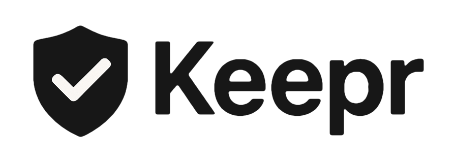

#  

# Keepr - Система мониторинга ИТ-активов

Keepr - это современная система для мониторинга и управления ИТ-активами, которая помогает отслеживать состояние серверов, лицензий и SSL-сертификатов. Система предоставляет интерфейс для ведения реестра активов, гибкое API для интеграции и автоматические уведомления о важных событиях.

## Основные возможности

- Мониторинг различных типов активов:
  - 🖥️ Серверы и устройства
  - 🔑 Лицензии ПО
  - 🔒 SSL-сертификаты
- Отслеживание сроков действия
- Автоматические уведомления через Telegram и email
- Система ролей (админ, редактор, просмотр)
- Современный веб-интерфейс
- REST API для интеграции

## 🚀 Развертывание

### Предварительные требования

- Docker и Docker Compose
- Node.js 14+
- Telegram бот (для уведомлений)
- SMTP сервер (для email уведомлений)

### Шаги развертывания

1. Клонируйте репозиторий:
```bash
git clone https://github.com/spinogrizz/keepr.git
cd keepr
```

2. Создайте файл `.env` в корневой директории:
```env
TELEGRAM_BOT_TOKEN=your_bot_token
TELEGRAM_CHAT_ID=your_chat_id
SMTP_HOST=your_smtp_host
SMTP_USER=your_smtp_user
SMTP_PASS=your_smtp_password
SMTP_PORT=587
JWT_SECRET=your_jwt_secret
```

3. Запустите приложение:
```bash
docker-compose up -d
```

После запуска:
- Frontend будет доступен по адресу: http://localhost:8080
- Backend API будет доступен по адресу: http://localhost:3000

## 📡 API Endpoints

### Активы (Assets)

#### GET /api/assets
Получение списка всех активов с детальной информацией.

#### GET /api/assets/:id
Получение информации о конкретном активе по ID.

#### POST /api/assets
Создание нового актива. Требуемые поля:
- name
- asset_type (обязательно, одно из: DEVICE, LICENSE, CERTIFICATE)

Опциональные поля: project_id, location_id, responsible, description, creation_date, expiry_date

Дополнительные поля в зависимости от типа актива:
- Для DEVICE: ip_address, serial_num, model
- Для LICENSE: license_key, vendor, seat_count
- Для CERTIFICATE: domain_host, cert_file, cert_key_file


#### PUT /api/assets/:id
Обновление существующего актива. Все поля опциональны.


## 🤝 Вклад в проект

Вообще это дипломный проект для МТИ, но если вам ВДРУГ это пригодилось, присылайте merge requests :-D

